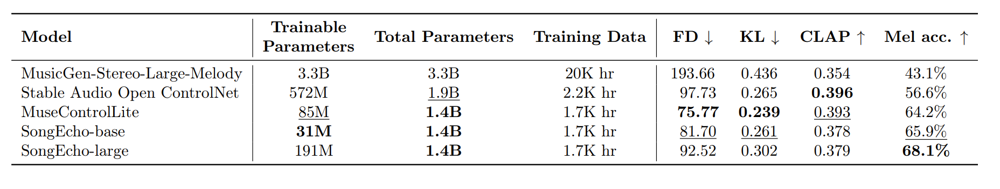

#  Text-to-Music control family
This repo collects methods for following time-varying controls on Stable-Audio Open. We provide checkpoints on [huggingface🤗](https://huggingface.co/fundwotsai2001/Text-to-Music_control_family) that follow melody condition (proposed in [stable-audio-control](https://stable-audio-control.github.io/)). Currently available:
| Model🤗 | Trainable parameters | inference VRAM fp16 | inference VRAM fp32 | RTF fp16 | RTF fp32 | 
|---|---|---|----|----|-:|
| `SongEcho_base` | 31M | 11.15 GB	| 15.7 GB | 0.130 | 0.143
| `SongEcho_large` | 198M | 11.83 GB| 16.5 GB | 0.145 | 0.157
| `MuseControlLite` | 85M | 11.44 GB | 15.9 GB | 0.158 | 0.153



All checkpoints are trained and evaluated on the datasets mentioned in [MuseControlLite](https://openreview.net/forum?id=VK47MdCjBH) with a single A6000 for 70000 steps (10~12 days) with batch size = 128, and the real time factor (RTF) are tested on A6000 as well. 

## Research paper
1. [SongEcho📑](https://openreview.net/forum?id=TEKOayiQg2)
2. [MuseControlLite📑](https://openreview.net/forum?id=VK47MdCjBH)

### Install
First clone the repo from [github](https://github.com/fundwotsai2001/MuseControlLite) and create the python enviornment:
```
git clone https://github.com/fundwotsai2001/Text-to-Music_control_family.git
cd Time-varying_controls_text-to-musi

## Install environment
conda create -n ttm-control python=3.11
conda activate ttm-control
pip install -r requirements.txt
sudo apt install ffmpeg # For Linux
```

### Inference:
```
python control_melody_inference.py
# This code will automatically download stable-audio open and the adapters
# Simply choose method from SongEcho_base, SongEcho_large, MuseControlLite.
```
### Training:
```
# Adjust config_training.py
python control_melody_train.py
```
### Cite this paper with 
```
@article{tsai2025musecontrollite,
  title={MuseControlLite: Multifunctional Music Generation with Lightweight Conditioners},
  author={Tsai, Fang-Duo and Wu, Shih-Lun and Lee, Weijaw and Yang, Sheng-Ping and Chen, Bo-Rui and Cheng, Hao-Chung and Yang, Yi-Hsuan},
  journal={arXiv preprint arXiv:2506.18729},
  year={2025}
}
@misc{songecho_openreview_2025,
  title        = {SongEcho: Cover Song Generation via Instance-Adaptive Element-wise Linear Modulation},
  author       = {Anonymous},
  howpublished = {OpenReview},
  year         = {2025},
  month        = sep,
  note         = {ICLR 2026 Conference Submission (under review)},
  url          = {https://openreview.net/forum?id=TEKOayiQg2}
}

```